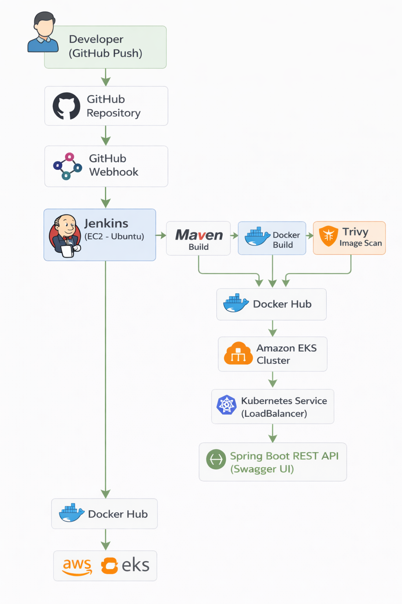

# CI/CD Pipeline for Spring Boot Application on AWS EKS

This project demonstrates an end-to-end CI/CD pipeline for a Java Spring Boot
application using Jenkins, Docker, Trivy, and Kubernetes (EKS).

## 🚀 Tech Stack
- Java, Spring Boot
- Jenkins
- Docker & Docker Hub
- Trivy (Image Security Scanning)
- AWS EC2 & EKS
- Kubernetes

## 🔁 CI/CD Workflow
1. Code pushed to GitHub triggers Jenkins via webhook
2. Jenkins performs:
   - Source code checkout
   - Maven build
   - Docker image build
   - Trivy vulnerability scan
   - Push image to Docker Hub
3. Application deployed to AWS EKS
4. Service exposed using LoadBalancer
5. Application verified via Swagger UI

## 🔐 Security
- Docker image scanned using Trivy
- Pipeline fails on HIGH or CRITICAL vulnerabilities

## 🏗 Architecture Diagram

## 📸 Screenshots
Pipeline execution and application access screenshots are available in the `screenshots/` folder.

## 📦 Application
Spring Petclinic REST API (backend-only)

## ✅ Status
Project 2 – Application Deployment to EKS using Jenkins & Docker (Completed)
